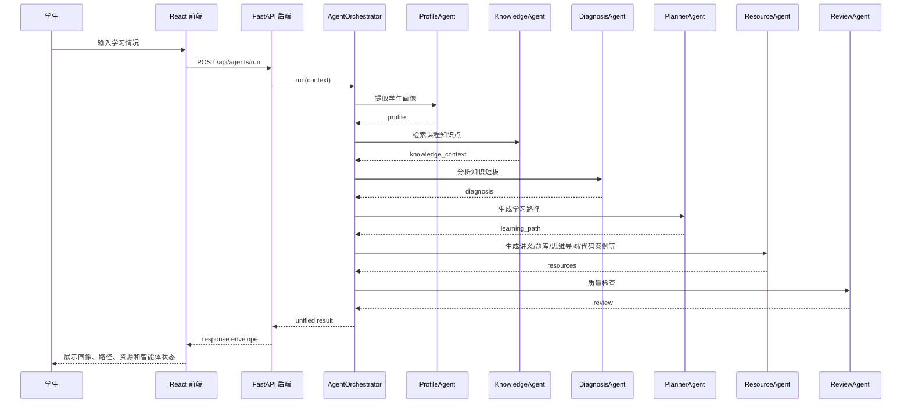

# Runtime Kit 模块协作流程

## 1. Agent Pipeline (6 agents)

各处理模块由 `AgentOrchestrator` 统一调度。管线依次运行，每个模块的输出会合并进共享上下文。

| Agent | Chinese Name | Responsibility | Status |
| --- | --- | --- | --- |
| `ProfileAgent` | 画像模块 | 从用户输入中提取 8 个维度学生画像 | Real (DeepSeek) |
| `KnowledgeAgent` | 知识检索模块 | 根据 `course_id` 定位课程知识点和章节内容 | Mock |
| `DiagnosisAgent` | 诊断模块 | 根据画像和课程要求识别知识短板 | Mock |
| `PlannerAgent` | 路径规划模块 | 生成阶段化学习路径 | Mock |
| `ResourceAgent` | 资源模块 | 生成讲义、题库、拓展阅读、实操案例、思维导图、视频脚本等 6 类资源 | Mock (schema ready) |
| `ReviewAgent` | 质量检查模块 | 检查格式完整性、资源覆盖度和内容安全 | Mock |

> **注意**: 思维导图 (Mermaid) 由 `ResourceAgent` 作为 `mindmap` 类型资源生成，不作为独立 Agent 存在。

## 2. Main Flow



## 3. BaseAgent 统一接口

```python
class BaseAgent(ABC):
    agent_id: str
    agent_name: str

    def __init__(self, mock_data=None, llm_client=None): ...

    @abstractmethod
    def run(self, context: dict) -> dict: ...

    def validate_result(self, result: dict) -> None: ...
    def get_fallback(self, context=None) -> dict: ...
```

每个 agent 从 `context` 读取输入，返回包含 `agent_step` 元数据和领域输出键（如 `profile`、`diagnosis`、`learning_path`、`resources` 等）的字典。

## 4. Stage 2 编排特性

第二阶段新增以下机制：

- **逐 agent 错误隔离**: 单个 agent 失败（`status: "failed"`）不会导致整个编排器崩溃。管线继续执行后续 agent，最终返回 `overall_status: "partial"` 并附带成功的部分结果。
- **逐 agent 超时**: 通过 `ThreadPoolExecutor` + `future.result(timeout=N)` 实现。默认超时 60 秒 (`settings.agent_timeout`)。
- **结构化步骤追踪**: 每个 agent 步骤记录 `agent_id`、`agent_name`、`status`、`summary`、`error`、`duration_ms`、`started_at`、`finished_at`。
- **部分结果聚合**: 成功的 agent 输出合并到最终结果；失败的 agent 提供空回退结构。

## 5. LLM 客户端规则

智能体不能直接写死某个大模型 API。所有模型调用必须通过统一客户端：

```python
self.llm_client.chat(messages, timeout=60)
```

当前支持的 Provider：

| Provider | 类 | 说明 |
| --- | --- | --- |
| `mock` | `MockLLMClient` | 返回确定性 mock 响应（开发/测试默认） |
| `deepseek` | `DeepSeekLLMClient` | OpenAI 兼容 HTTP 客户端，内置重试逻辑 |

通过环境变量 `LLM_PROVIDER` 切换。DeepSeek 客户端支持配置重试次数 (`llm_retry_count`) 和请求超时 (`llm_request_timeout`)。

## 6. 质量控制 (ReviewAgent)

质量检查智能体至少检查：

- 响应字段是否完整。
- 是否覆盖至少 5 类学习资源。
- 资源是否与学生画像匹配。
- 是否存在明显敏感或不适合学习场景的内容。
- 当知识库证据不足时，是否提示内容来源不充分。
