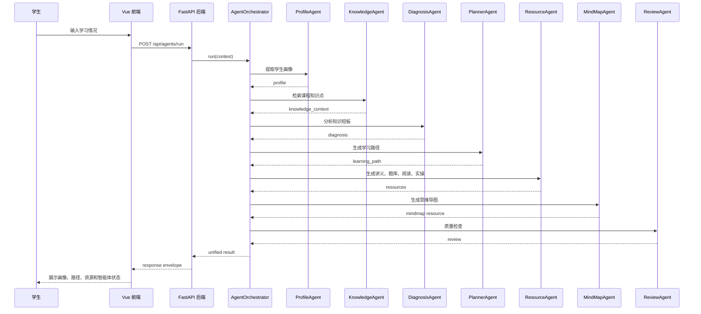

# EduAgent 多智能体协作流程

## 1. Stage 1 Agent List

第一阶段采用轻量多智能体流程。智能体属于后端模块，由 `AgentOrchestrator` 统一调度。

| Agent | Chinese Name | Responsibility |
| --- | --- | --- |
| `ProfileAgent` | 画像智能体 | 从用户输入中提取 8 个维度学生画像 |
| `KnowledgeAgent` | 知识库智能体 | 根据 `course_id` 定位课程知识点和章节内容 |
| `DiagnosisAgent` | 学习诊断智能体 | 根据画像和课程要求识别知识短板 |
| `PlannerAgent` | 路径规划智能体 | 生成阶段化个性化学习路径 |
| `ResourceAgent` | 资源生成智能体 | 生成讲义、题库、拓展阅读和实操案例 |
| `MindMapAgent` | 思维导图智能体 | 生成 Mermaid 思维导图 |
| `ReviewAgent` | 质量检查智能体 | 检查格式完整性、资源覆盖度和内容安全 |

## 2. Main Flow



## 3. Stage 1 Implementation Strategy

第一阶段不直接追求复杂 Agent 框架，先使用 Python 类或函数实现。

统一接口：

```python
class BaseAgent:
    def run(self, context: dict) -> dict:
        raise NotImplementedError
```

统一上下文：

```json
{
  "session_id": "demo_session_001",
  "course_id": "ai_intro",
  "user_message": "...",
  "profile": {},
  "diagnosis": {},
  "learning_path": [],
  "resources": [],
  "knowledge_context": []
}
```

## 4. LLM Replacement Rule

智能体不能直接写死某个大模型 API。所有模型调用必须通过统一客户端：

```python
self.llm.chat(messages)
```

第一阶段默认：

```text
MockLLMClient
```

第二阶段可切换：

```text
SparkClient
DeepSeekClient
QwenClient
```

## 5. Quality Control

质量检查智能体至少检查：

- 响应字段是否完整。
- 是否覆盖 5 类学习资源。
- 资源是否与学生画像匹配。
- 是否存在明显敏感或不适合学习场景的内容。
- 当知识库证据不足时，是否提示内容来源不充分。

