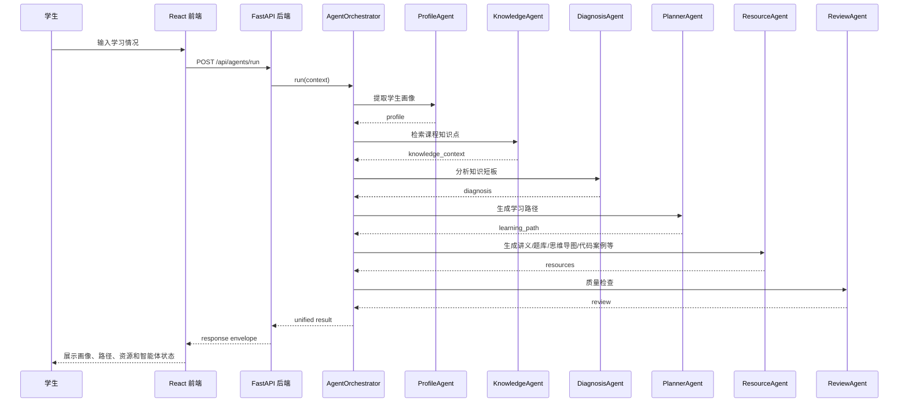

# Runtime Kit 模块协作流程

## 1. Agent Pipeline (9 agents)

各处理模块由 `LangGraph Orchestrator` 统一调度。管线依次运行，每个模块的输出会合并进共享上下文。

| Agent | Chinese Name | Responsibility | Status |
| --- | --- | --- | --- |
| `ConversationAgent` | 对话智能体 | 意图分类、总控调度、最终回复生成 | Real (DeepSeek) |
| `ProfileAgent` | 画像模块 | 从用户输入中提取 10 维度学生画像 | Real (DeepSeek) |
| `KnowledgeAgent` | 知识检索模块 | 根据 `course_id` 定位课程知识点和章节内容 | Real (RAG) |
| `DiagnosisAgent` | 诊断模块 | 根据画像和课程要求识别知识短板，支持自适应三步诊断 | Real (DeepSeek) |
| `PlannerAgent` | 路径规划模块 | 四阶段 LLM 生成学习路径（Architect→Creator→Reviewer→Refine） | Real (DeepSeek) |
| `ResourceAgent` | 资源模块 | 生成讲义、题库、拓展阅读、实操案例、思维导图、视频脚本等 6 类资源 | Real (DeepSeek) |
| `QuestionAgent` | 试题生成智能体 | 生成选择/填空/判断/简答/变式题，含自洽性检验、难度校准、去重 | Real (DeepSeek) |
| `GradingAgent` | 自动批改智能体 | 四维评分（推理 40%/完整 30%/计算 20%/表达 10%），五种错误分类 | Real (DeepSeek) |
| `ReviewAgent` | 质量检查模块 | 检查格式完整性、资源覆盖度和内容安全 | Real (DeepSeek) |
| `MultimodalAgent` | 多模态智能体 | 图片理解、思维导图生成、视频脚本生成（独立调用） | Real |

> **注意**: QuestionAgent 和 GradingAgent 可作为独立服务调用（无需完整管线）。小测/题集生成通过 `POST /api/sections/{id}/quiz/generate` 和 `POST /api/exam-sets/generate` 直接调用 LLM，提交作答时通过 `submit` 端点调用 GradingAgent。

## 2. Main Flow


```mermaid
sequenceDiagram
  participant User as 学生
  participant Frontend as React 前端
  participant API as FastAPI 后端
  participant Orchestrator as AgentOrchestrator
  participant Profile as ProfileAgent
  participant Knowledge as KnowledgeAgent
  participant Diagnosis as DiagnosisAgent
  participant Planner as PlannerAgent
  participant Resource as ResourceAgent
  participant Review as ReviewAgent

  User->>Frontend: 输入学习情况
  Frontend->>API: POST /api/agents/run
  API->>Orchestrator: run(context)
  Orchestrator->>Profile: 提取学生画像
  Profile-->>Orchestrator: profile
  Orchestrator->>Knowledge: 检索课程知识点
  Knowledge-->>Orchestrator: knowledge_context
  Orchestrator->>Diagnosis: 分析知识短板
  Diagnosis-->>Orchestrator: diagnosis
  Orchestrator->>Planner: 生成学习路径
  Planner-->>Orchestrator: learning_path
  Orchestrator->>Resource: 生成讲义/题库/思维导图/代码案例等
  Resource-->>Orchestrator: resources
  Orchestrator->>Review: 质量检查
  Review-->>Orchestrator: review
  Orchestrator-->>API: unified result
  API-->>Frontend: response envelope
  Frontend-->>User: 展示画像、路径、资源和智能体状态
```

## 3. BaseAgent 统一接口

```python
class BaseAgent(ABC):
    agent_id: str
    agent_name: str

    def __init__(self, mock_data=None, llm_client=None): ...

    @abstractmethod
    def run(self, context: dict) -> dict: ...

    def validate_result(self, result: dict) -> None: ...
    def get_fallback(self, context=None) -> dict: ...
```

每个 agent 从 `context` 读取输入，返回包含 `agent_step` 元数据和领域输出键（如 `profile`、`diagnosis`、`learning_path`、`resources` 等）的字典。

## 4. Stage 2 编排特性

第二阶段新增以下机制：

- **逐 agent 错误隔离**: 单个 agent 失败（`status: "failed"`）不会导致整个编排器崩溃。管线继续执行后续 agent，最终返回 `overall_status: "partial"` 并附带成功的部分结果。
- **逐 agent 超时**: 通过 `ThreadPoolExecutor` + `future.result(timeout=N)` 实现。默认超时 60 秒 (`settings.agent_timeout`)。
- **结构化步骤追踪**: 每个 agent 步骤记录 `agent_id`、`agent_name`、`status`、`summary`、`error`、`duration_ms`、`started_at`、`finished_at`。
- **部分结果聚合**: 成功的 agent 输出合并到最终结果；失败的 agent 提供空回退结构。

## 5. LLM 客户端规则

智能体不能直接写死某个大模型 API。所有模型调用必须通过统一客户端：

```python
self.llm_client.chat(messages, timeout=60)
```

当前支持的 Provider：

| Provider | 类 | 说明 |
| --- | --- | --- |
| `mock` | `MockLLMClient` | 返回确定性 mock 响应（开发/测试默认） |
| `deepseek` | `DeepSeekLLMClient` | OpenAI 兼容 HTTP 客户端，内置重试逻辑 |

通过环境变量 `LLM_PROVIDER` 切换。DeepSeek 客户端支持配置重试次数 (`llm_retry_count`) 和请求超时 (`llm_request_timeout`)。

## 6. 质量控制 (ReviewAgent)

质量检查智能体至少检查：

- 响应字段是否完整。
- 是否覆盖至少 5 类学习资源。
- 资源是否与学生画像匹配。
- 是否存在明显敏感或不适合学习场景的内容。
- 当知识库证据不足时，是否提示内容来源不充分。
