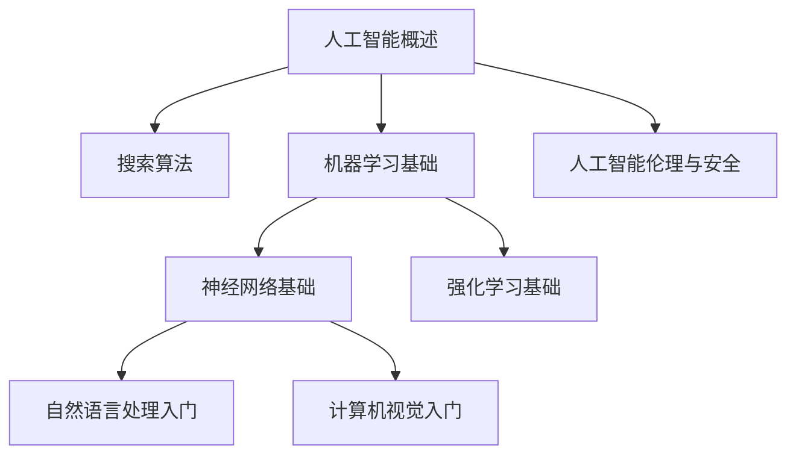

# 人工智能导论课程大纲

## 课程定位

《人工智能导论》面向计算机、人工智能、电子信息、自动化等相关专业低年级学生，也适合具备基础编程能力的跨专业学习者。

课程目标是帮助学生建立人工智能领域的整体认知，理解核心概念、典型方法和应用场景，并具备继续学习机器学习、深度学习、自然语言处理和计算机视觉等方向的基础。

## 章节结构

| 章节 | 主题 | 难度 | 先修要求 |
| --- | --- | --- | --- |
| 01 | 人工智能概述与发展历史 | 入门 | 无 |
| 02 | 搜索算法与问题求解 | 中等 | 基础数据结构 |
| 03 | 机器学习基础 | 中等 | Python 基础、概率统计基础 |
| 04 | 神经网络基础 | 中等 | 机器学习基础、线性代数基础 |
| 05 | 自然语言处理入门 | 中等 | 机器学习基础、神经网络基础 |
| 06 | 计算机视觉入门 | 中等 | 机器学习基础、神经网络基础 |
| 07 | 强化学习基础 | 较难 | 机器学习基础、概率统计基础 |
| 08 | 人工智能伦理与安全 | 入门 | 人工智能概述 |

## 知识依赖关系



## 第一阶段重点知识点

第一阶段优先完成以下 4 章内容：

1. 人工智能概述与发展历史
2. 搜索算法与问题求解
3. 机器学习基础
4. 神经网络基础

这些内容足以支持第一阶段演示案例：

```text
电子信息专业大二学生，Python 基础中等，机器学习薄弱，希望两周入门人工智能，重点理解神经网络和自然语言处理。
```

## 资源生成目标

系统应基于课程大纲生成：

- 个性化课程讲义
- 知识点思维导图
- 练习题
- 拓展阅读材料
- Python 实操案例
- 可选视频脚本或 PPT 大纲

